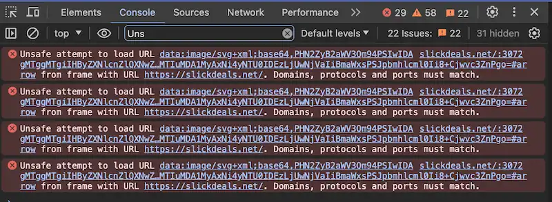

# Motivation

When dealing with various codebases in development, you'll come across perhaps hundreds of logs per minute. 

Some of these are supposed to be useful. As it's just sending out unstructured text, it can be hard to find what you want. Furthermore, it often lacks **syntax highlighting** - it is hard to know where one log ends and another starts.

Example Output:
```
Info 2024-04-08 19:10:00,779 /opt/tmp/file_seq.data
stringified { "a": 1, "b": 2, "c": 14.657513584604953, "foo": { "a": 1, "b": 2, "c": 14.657513584604953, "bar":  { "a": 1, "b": 2, "c": 14.657513584604953 } } }
[INFO] /opt/file_thing.sock:019 | all systems go
Debug received POST, GET, PATCH, PUT, and DELETE from 192.168.1.1 (somehow)
[INFO] 2024-04-13T07:03:50.305Z "log random" 15
```

In contrast, something like your browser's dev console allows filtering, highlighting, and inspection of "unstructured" logs. 



The goal is to bring tools like this to any terminal output!

## The Problem Landscape

There are a few fundamental problems with modern logging behavior.

### (Development) Logs Are Unstructured

Sure, we conform to some structure for production, but it's the wild-west during development. 

Even if you've standardized your logging structure, the libraries your code makes calls to may conform to some other structure.

With enough abstraction, you end up with multiple layers of logs using different structures. Unlike production, we cannot expect our logs to maintain a consistent form.

### Terminals have no "breaks"

We can use the newline to delineate where one log ends, but some tools try to be nice and split logs across multiple lines. This makes it hard to know which data is associated with a log item.

Given a log of serialized data "`{ "a": 1, "b": 2, "c": 14.657513584604953, "foo": { "a": 1, "b": 2, "c": 14.657513584604953, "bar":  { "a": 1, "b": 2, "c": 14.657513584604953, "baz": "bar":  { "a": 1, "b": 2, "c": 14.657513584604953 }  } } }`" it can often span multiple lines due to wrapping behavior, but still be a part of the original log.

Naively splitting by newlines will mistakenly chunk this log into 5 separate instances, making it less readable than it originally was.
```sh
{
  "foo": 1,
  "bar": 42
  "baz": 100
}
```

### Syntax Highlighting Is "For Production"

You're not thinking about adding good syntax highlighting. Your terminal doesn't want to guess.

So you're just staring at an amalgum of white lettering, hoping to make sense of whether you're looking at a number literal or a string-number ID.


## Solutions

By focusing on **development** logging, we can make guesses about the output that wouldn't be safe to assume for production logging inspection. Our problem domain and risks are fundamentally different.

We can guess at syntax highlighting. We can guess at chunking behavior. We can make arbitrary decisions for the sake of convenience. 

We don't need to be **correct**, we just need to be <span style="color: salmon">**helpful**</span>.